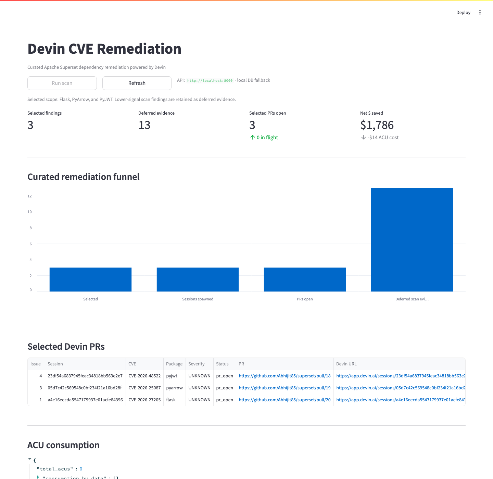

# Devin CVE Remediation

> An event-driven automation that turns CVE scan results into merged
> pull requests by spawning autonomous Devin sessions. Built as a
> reference architecture for **partner-deployed engineering** at
> Cognition — designed to be cloned by a GSI SE or hyperscaler partner
> for each new customer engagement.

---

## TL;DR

```
┌──────────────┐   POST /scan/run   ┌───────────────┐
│ GitHub Action├───────────────────▶│ Orchestrator  │
│  (nightly)   │                    │   FastAPI     │
└──────────────┘                    └──────┬────────┘
                                           │  spawns
                                  Devin Playbook +
                                  POST /v3/sessions
                                           │
                                           ▼
                                  ┌─────────────────┐
                                  │ Devin sessions  │
                                  │  (one per CVE)  │
                                  └────────┬────────┘
                                           │  opens
                                           ▼
                                  ┌─────────────────┐
                                  │ Pull Requests   │ ──▶ Human review
                                  │ on superset fork│
                                  └─────────────────┘

                  Dashboard ──pulls──▶ SQLite + Devin Metrics API
                 (Streamlit)          (sessions, PRs, ACU spend, $ saved)
```

**What it does.** Scans an Apache Superset fork for vulnerable Python
dependencies, files a GitHub issue per finding, spawns one Devin session
per issue using a versioned remediation Playbook, and tracks every
session through to a PR. A Streamlit dashboard answers the one question
an eng leader actually has: *"is this working?"*

**Why it matters for Cognition.** This isn't a one-off automation — it's
a **productizable playbook** that maps directly to a GSI service line
(Application Security Managed Services) or a hyperscaler marketplace
offering. See [`docs/partner-playbook.md`](docs/partner-playbook.md) for
the full partner story.

**Companion Superset fork.** The real remediation target is
[`Abhijit85/superset`](https://github.com/Abhijit85/superset). See the
[selected issues](https://github.com/Abhijit85/superset/issues?q=label%3Ademo-selected)
and [Devin remediation PRs](https://github.com/Abhijit85/superset/pulls)
for observable proof that the workflow ran against Apache Superset.

---

## Dashboard Preview



The local dashboard runs at `http://localhost:8501` during development,
but that URL is not a hosted demo link. Use this screenshot or the Loom
walkthrough for submission review.

See [`docs/demo-evidence.md`](docs/demo-evidence.md) for the concrete
issue, PR, and Devin session links.

---

## Quickstart

### Prereqs
- Docker + Docker Compose
- A Devin service-user API key (or skip with `DEVIN_MOCK=1`)
- A GitHub PAT with `repo` scope on your Superset fork (optional —
  without it the orchestrator runs but doesn't file GH issues)

### Run with real Devin

```bash
git clone https://github.com/<you>/devin-cve-remediation
cd devin-cve-remediation
cp .env.example .env          # fill in DEVIN_API_KEY, DEVIN_ORG_ID, GH_TOKEN, GH_REPO

# Clone the Superset fork next to this repo (or set REPO_PATH in .env)
git clone https://github.com/<you>/superset

# One-time: register the Playbook with Devin
python -m pip install -r requirements.txt
python scripts/bootstrap_playbook.py

# Bring everything up
docker compose up --build
```

Then:
- Orchestrator API: <http://localhost:8000/docs>
- Dashboard: <http://localhost:8501>

These are local development URLs; they only resolve on the machine
running Docker Compose.

### Run in mock mode (no Devin account needed)

```bash
DEVIN_MOCK=1 docker compose up --build
```

The mock client simulates sessions that "complete" after a few polls and
fabricate PR URLs. Useful for evaluating the architecture without
credentials.

### Trigger a scan manually

```bash
python scripts/demo_seed.py --url http://localhost:8000 --watch
```

…or via curl:

```bash
curl -X POST http://localhost:8000/scan/run
```

…or wait for the nightly GitHub Action (see
`.github/workflows/nightly-scan.yml`).

---

## How it works

### 1. Trigger (event-driven)
Any of three paths fires a scan:

| Source | Path | When to use |
|---|---|---|
| **Scheduled** | GitHub Action cron → `POST /scan/run` | Default. Proves the periodic case. |
| **Webhook** | GitHub `issues.opened` w/ label `devin-remediate` → `POST /github/webhook` | One-off remediations filed by humans or other tools. |
| **Manual** | `POST /scan/run` via curl / `demo_seed.py` | Demos, smoke tests. |

The orchestrator doesn't care which fired — they converge on the same
finding → session path.

### 2. Scan → findings
`orchestrator/scanner.py` wraps `pip-audit` against Superset's
`requirements/*.txt`. Findings are normalized to a stable fingerprint
(`{CVE}:{package}`) so re-runs are idempotent. If `pip-audit` isn't
available the scanner falls back to a fixed set of realistic CVEs so
demos are deterministic.

### 3. Devin as the worker
For each new finding:
1. A GitHub issue is filed with structured details and the
   `devin-remediate` label.
2. One Devin session is created via
   `POST /v3/organizations/{org}/sessions` with:
   - The full Playbook prompt (`playbooks/cve_remediation_v1.md`)
     concatenated with the finding payload.
   - Tags: `cve-remediation`, `severity:<level>`, `package:<name>`,
     `source:<scanner>`.
3. The session URL is posted back as a comment on the GitHub issue.

### 4. Poller closes the loop
A background asyncio task polls each active session every 30s. When a
session reaches `exit`, the PR URL is extracted and:
- The DB session row is updated.
- The source GitHub issue gets a "✅ PR opened: …" comment.
- The finding moves to `pr_open` status.

### 5. Observability
The Streamlit dashboard reads from:
- Local SQLite (issue → session → PR mapping, latencies)
- The Devin Metrics API (`/metrics/sessions`, `/metrics/prs`,
  `/consumption/daily`) — i.e. the **canonical** source of truth lives
  in Devin, the orchestrator's local DB just adds workflow context.

This split is intentional and is the reason the workflow logic stays
under ~1,000 LOC: most of what the dashboard needs already exists in
Devin's API. **That's the message** — a partner integration should be
a thin glue layer, not a re-implementation.

---

## Repository layout

```
devin-cve-remediation/
├── README.md                          # This file
├── docker-compose.yml
├── Dockerfile
├── requirements.txt
├── .env.example
├── orchestrator/
│   ├── main.py                        # FastAPI app
│   ├── devin_client.py                # Thin v3 API wrapper (+ MockDevinClient)
│   ├── github_client.py
│   ├── scanner.py                     # pip-audit + fixture fallback
│   ├── poller.py                      # Background session status poller
│   └── db.py                          # SQLite state
├── dashboard/
│   └── app.py                         # Streamlit dashboard
├── playbooks/
│   └── cve_remediation_v1.md          # The SOP Devin executes — the asset
├── scripts/
│   ├── bootstrap_playbook.py          # Register Playbook with Devin (idempotent)
│   └── demo_seed.py                   # Manual trigger + watch helper
├── .github/workflows/
│   └── nightly-scan.yml               # The "event" in event-driven
└── docs/
    ├── architecture.md
    ├── partner-playbook.md            # How a GSI / hyperscaler resells this
    └── loom-script.md                 # 5-minute pitch script
```

---

## Design decisions worth knowing about

**Why `pip-audit` and not Trivy / Snyk?** Faster to wire up against
Python repos; trivially swappable. The scanner module exposes a single
`scan_repo()` function so adding a new source is one file.

**Why SQLite and not Postgres?** One container, no migrations, no setup.
A production partner deployment would swap to Postgres + Alembic — the
DB module is the only thing that changes.

**Why a background poller and not webhooks from Devin?** Devin's webhook
support is evolving; polling is robust, idempotent, and easy to reason
about. Swap when first-class session-completed webhooks ship.

**Why one PR per CVE and not batched?** PR-per-CVE is the cleaner
audit/compliance story for the customer's security team. It's also
what GSIs invoice against. Don't batch what you're billing per-unit on.

**Why the Playbook lives in this repo and not just in Devin?** It needs
to be version-controlled, reviewable in PRs, and portable across customer
orgs. `bootstrap_playbook.py` syncs it into Devin; Devin is the runtime,
the Git repo is the source of truth.

**Why the Mock client?** So evaluators (and CI) can run the whole demo
without burning ACU or needing real credentials. `DEVIN_MOCK=1` and
you're off.

---

## What this would look like in a real customer engagement

See [`docs/partner-playbook.md`](docs/partner-playbook.md). Short version:

1. **GSI sells** a fixed-price "CVE Burndown" engagement to an enterprise
   customer ($500K-$2M, 90-day backlog clearance).
2. **Partner SE clones this repo**, swaps the customer's repo URL,
   adjusts the Playbook for their internal coding standards, deploys.
3. **Devin executes** the work; the orchestrator + dashboard are the
   delivery and reporting surface the partner shows the customer's CISO.
4. **Cognition gets** consumption revenue + a marquee logo for the
   hyperscaler marketplace.

The artifacts in this repo — the Playbook, the orchestrator shape, the
dashboard — are the parts that get reused. Everything is the template.

---

## Limitations & next steps

- **HMAC verification on the GitHub webhook** is stubbed; production
  would validate `X-Hub-Signature-256`.
- **Auth on the orchestrator endpoints** is just a bearer token in the
  GH Action example; a real deployment needs proper SSO / mTLS.
- **PR-merge tracking** isn't wired up — the funnel shows merges as 0
  pending a `pull_request.closed` webhook handler.
- **Slack / Teams notifications** could trivially be added to the poller
  using Devin's existing integrations.
- **Multi-repo support**: trivial — `scan_repo` already takes a path.

---

## License

Apache-2.0. Built as a take-home for Cognition.
